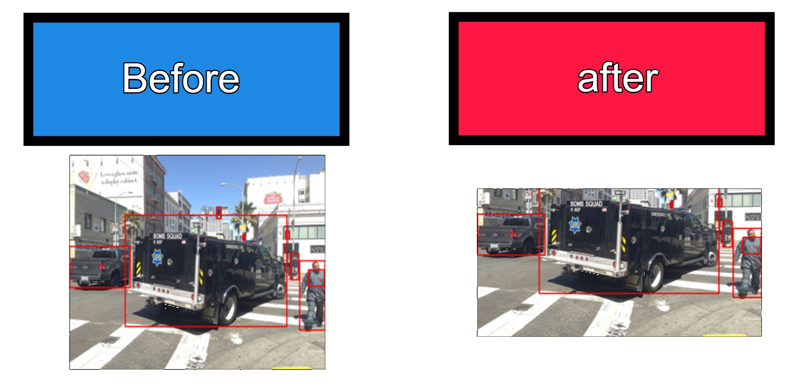

# Sky removal tool
This program uses Detectron2 pre-trained model and removes skies in the COCO dataset

Editing bboxes too, and updating the JSON file with them
output json will be named data.json and the images will be at the folder
"sky_terminated_images"



### Dependencies 
I used Python 3.8

Pytorch, Cuda and Numpy
```sh
$ conda install pytorch torchvision torchaudio cudatoolkit=11.0 -c pytorch
$ pip install numpy
$ pip install opencv-python
```
Installing detectron2:
```sh
$ git clone https://github.com/facebookresearch/detectron2
$ cd detectron2
$ pip install -e .
```


### Installation

```sh
$ git clone https://github.com/Xcompanygames/Sky_Cutter
```
COCO dataset:
https://cocodataset.org/#


### How to use
* Put the Sky_Cutter.ipynb file in a folder with a zip containing images 
* Under "Loading our data" change resp to the name of your zip 
* Unzip the file
* Run ALL the notebook
* A folder named sky_treminated_images will be created, in it all the images that detectron2 found a sky in them and deleted them, output json will be named data.json

### Remove all backdrops
* To remove all backdrops and not just the sky:
Search for: "and seg_list[indx]['category_id'] == 40" 
Delete this from the if statement.


### Credit
Made by Oriel Pinhas, Detectron2 by Facebook

